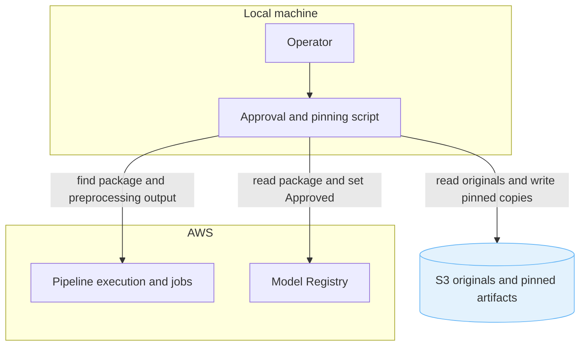

```mermaid
flowchart TB
    subgraph Local["Local machine"]
        Operator["Operator"]
        Script["Approval and pinning script"]
    end
    subgraph AWS["AWS"]
        Execution["Pipeline execution and jobs"]
        Registry["Model Registry"]
    end

    S3[("S3 originals and pinned artifacts")]

    Operator --> Script
    Script -->|find package and preprocessing output| Execution
    Script -->|read package and set Approved| Registry
    Script -->|read originals and write pinned copies| S3

    classDef dataStore fill:#E3F2FD,stroke:#64B5F6
    class S3 dataStore
```
