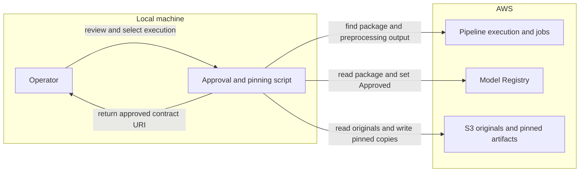

```mermaid
flowchart LR
    subgraph Local["Local machine"]
        Operator["Operator"]
        Script["Approval and pinning script"]
    end
    subgraph AWS["AWS"]
        Execution["Pipeline execution and jobs"]
        Registry["Model Registry"]
        S3["S3 originals and pinned artifacts"]
    end
    Operator -->|review and select execution| Script
    Script -->|find package and preprocessing output| Execution
    Script -->|read package and set Approved| Registry
    Script -->|read originals and write pinned copies| S3
    Script -->|return approved contract URI| Operator
```
