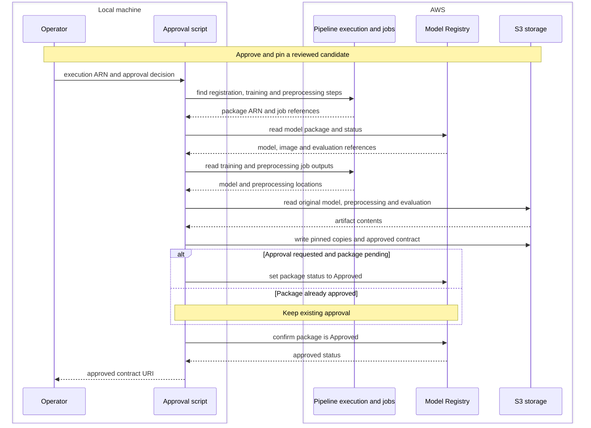

```mermaid
sequenceDiagram
    box Local machine
        participant Operator
        participant Script as Approval script
    end
    box AWS
        participant Execution as Pipeline execution and jobs
        participant Registry as Model Registry
        participant S3 as S3 storage
    end
    Note over Operator,S3: Approve and pin a reviewed candidate
    Operator->>Script: execution ARN and approval decision
    Script->>Execution: find registration, training and preprocessing steps
    Execution-->>Script: package ARN and job references
    Script->>Registry: read model package and status
    Registry-->>Script: model, image and evaluation references
    Script->>Execution: read training and preprocessing job outputs
    Execution-->>Script: model and preprocessing locations
    Script->>S3: read original model, preprocessing and evaluation
    S3-->>Script: artifact contents
    Script->>S3: write pinned copies and approved contract
    alt Approval requested and package pending
        Script->>Registry: set package status to Approved
    else Package already approved
        Note over Script,Registry: Keep existing approval
    end
    Script->>Registry: confirm package is Approved
    Registry-->>Script: approved status
    Script-->>Operator: approved contract URI
```
