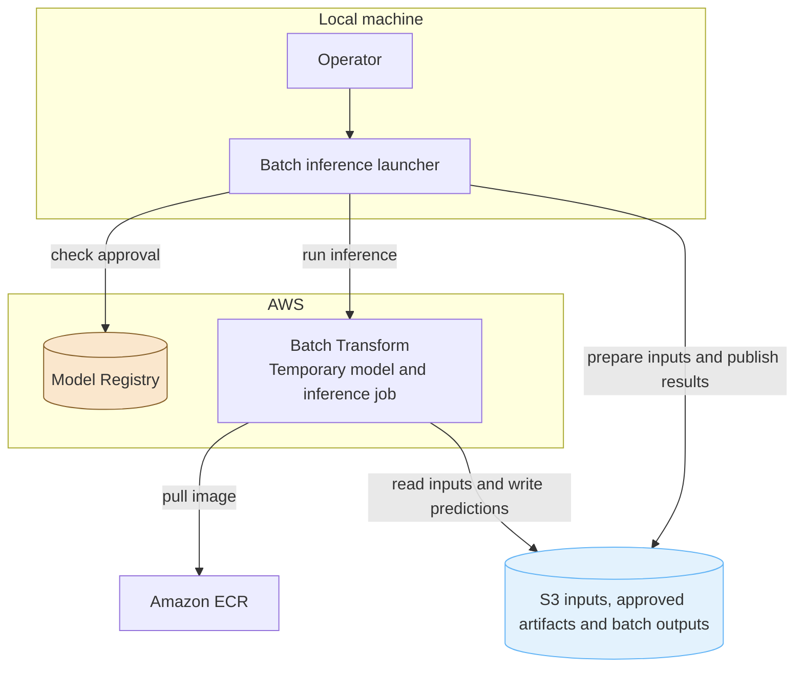

```mermaid
flowchart TB
    subgraph Local["Local machine"]
        Operator["Operator"]
        Launcher["Batch inference launcher"]
    end
    subgraph AWS["AWS"]
        Registry[("Model Registry")]
        Batch["Batch Transform<br/>Temporary model and inference job"]
    end

    ECR["Amazon ECR"] 

    S3[("S3 inputs, approved artifacts and batch outputs")]
 
    Operator --> Launcher
    Launcher -->|check approval| Registry
    Launcher -->|run inference| Batch
    Batch -->|pull image| ECR
    Launcher -->|prepare inputs and publish results| S3
    Batch -->|read inputs and write predictions| S3

    classDef dataStore fill:#E3F2FD,stroke:#64B5F6
    classDef registry fill:#fae7cd,stroke:#876029

    class S3 dataStore
    class Registry registry
```
