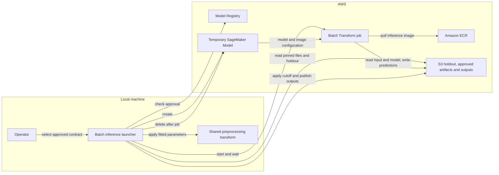

```mermaid
flowchart LR
    subgraph Local["Local machine"]
        Operator["Operator"]
        Launcher["Batch inference launcher"]
        Preprocess["Shared preprocessing transform"]
    end
    subgraph AWS["AWS"]
        Registry["Model Registry"]
        Model["Temporary SageMaker Model"]
        Job["Batch Transform job"]
        ECR["Amazon ECR"]
        S3["S3 holdout, approved artifacts and outputs"]
    end
    Operator -->|select approved contract| Launcher
    Launcher -->|check approval| Registry
    Launcher -->|read pinned files and holdout| S3
    Launcher -->|apply fitted parameters| Preprocess
    Launcher -->|create| Model
    Launcher -->|start and wait| Job
    Model -->|model and image configuration| Job
    Job -->|pull inference image| ECR
    Job -->|read input and model, write predictions| S3
    Launcher -->|apply cutoff and publish outputs| S3
    Launcher -->|delete after job| Model
```
