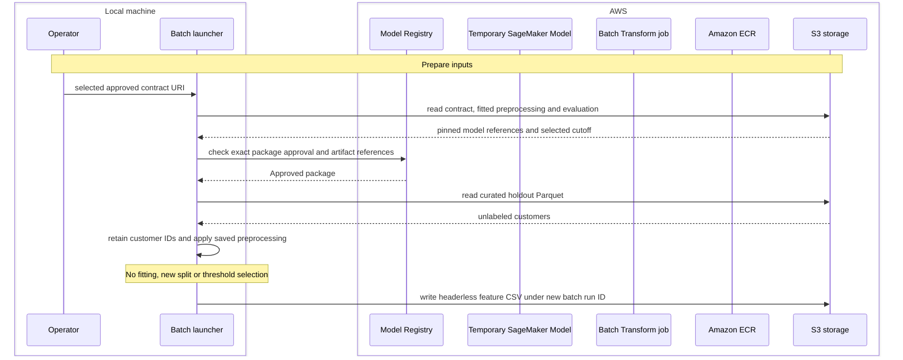

```mermaid
sequenceDiagram
    box Local machine
        participant Operator
        participant Launcher as Batch launcher
    end
    box AWS
        participant Registry as Model Registry
        participant Model as Temporary SageMaker Model
        participant Job as Batch Transform job
        participant ECR as Amazon ECR
        participant S3 as S3 storage
    end
    Note over Operator,S3: Prepare inputs
    Operator->>Launcher: selected approved contract URI
    Launcher->>S3: read contract, fitted preprocessing and evaluation
    S3-->>Launcher: pinned model references and selected cutoff
    Launcher->>Registry: check exact package approval and artifact references
    Registry-->>Launcher: Approved package
    Launcher->>S3: read curated holdout Parquet
    S3-->>Launcher: unlabeled customers
    Launcher->>Launcher: retain customer IDs and apply saved preprocessing
    Note over Launcher: No fitting, new split or threshold selection
    Launcher->>S3: write headerless feature CSV under new batch run ID
```
