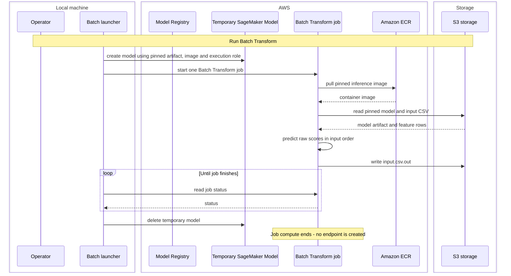

```mermaid
sequenceDiagram
    box Local machine
        participant Operator
        participant Launcher as Batch launcher
    end
    box AWS
        participant Registry as Model Registry
        participant Model as Temporary SageMaker Model
        participant Job as Batch Transform job
        participant ECR as Amazon ECR
    end
    box Storage
        participant S3 as S3 storage
    end
    Note over Operator,S3: Run Batch Transform
    Launcher->>Model: create model using pinned artifact, image and execution role
    Launcher->>Job: start one Batch Transform job
    Job->>ECR: pull pinned inference image
    ECR-->>Job: container image
    Job->>S3: read pinned model and input CSV
    S3-->>Job: model artifact and feature rows
    Job->>Job: predict raw scores in input order
    Job->>S3: write input.csv.out
    loop Until job finishes
        Launcher->>Job: read job status
        Job-->>Launcher: status
    end
    Launcher->>Model: delete temporary model
    Note over Job: Job compute ends - no endpoint is created
```
