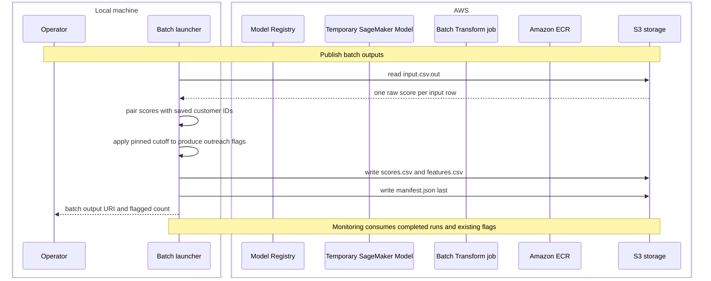

```mermaid
sequenceDiagram
    box Local machine
        participant Operator
        participant Launcher as Batch launcher
    end
    box AWS
        participant Registry as Model Registry
        participant Model as Temporary SageMaker Model
        participant Job as Batch Transform job
        participant ECR as Amazon ECR
        participant S3 as S3 storage
    end
    Note over Operator,S3: Publish batch outputs
    Launcher->>S3: read input.csv.out
    S3-->>Launcher: one raw score per input row
    Launcher->>Launcher: pair scores with saved customer IDs
    Launcher->>Launcher: apply pinned cutoff to produce outreach flags
    Launcher->>S3: write scores.csv and features.csv
    Launcher->>S3: write manifest.json last
    Launcher-->>Operator: batch output URI and flagged count
    Note over Launcher,S3: Monitoring consumes completed runs and existing flags
```
