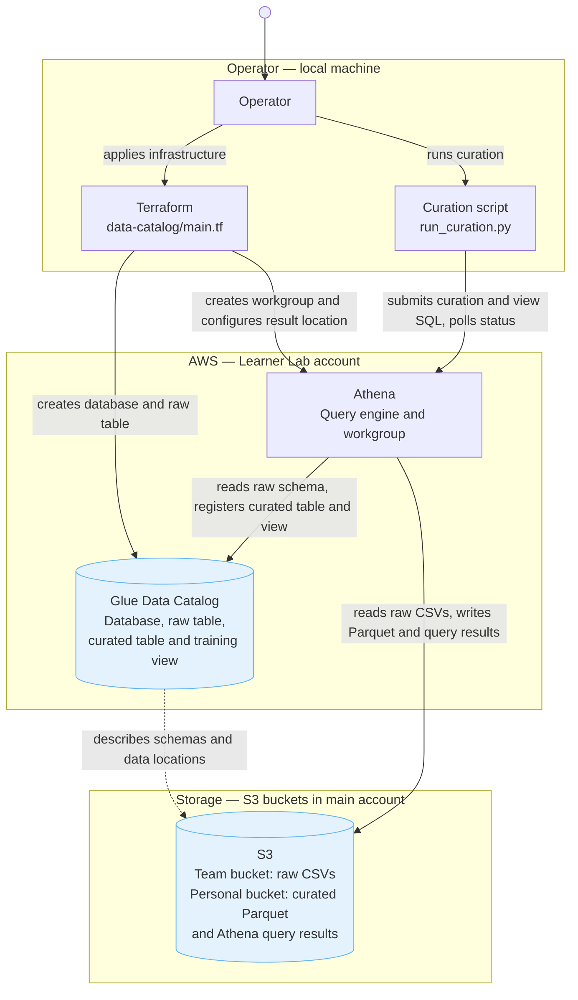

```mermaid
flowchart TB
    Start@{ shape: start }

    subgraph Local["Operator — local machine"]
        Operator["Operator"]
        Terraform["Terraform<br/>data-catalog/main.tf"]
        CurationScript["Curation script<br/>run_curation.py"]
    end

    subgraph AWS["AWS — Learner Lab account"]
        Glue[("Glue Data Catalog<br/>Database, raw table,<br/>curated table and training view")]
        Athena["Athena<br/>Query engine and workgroup"] 
    end

    subgraph Storage["Storage — S3 buckets in main account"]
        S3[("S3<br/>Team bucket: raw CSVs<br/>Personal bucket: curated Parquet<br/>and Athena query results")]
    end

    Start --> Operator
    Operator -->|applies infrastructure| Terraform
    Operator -->|runs curation| CurationScript
    Terraform -->|creates database and raw table| Glue
    Terraform -->|creates workgroup and configures result location| Athena
    CurationScript -->|submits curation and view SQL, polls status| Athena
    Athena -->|reads raw schema, registers curated table and view| Glue
    Athena -->|reads raw CSVs, writes Parquet and query results| S3
    Glue -.->|describes schemas and data locations| S3

    classDef dataStore fill:#E3F2FD,stroke:#64B5F6
    class Glue,S3 dataStore
```
