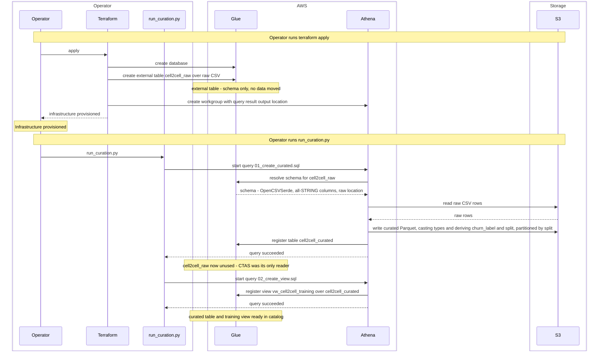

```mermaid
sequenceDiagram
    box Operator
        participant Operator
        participant Terraform
        participant CurationScript as run_curation.py
    end
    box Infrastructure as code
       
    end
    box AWS
        participant Glue
        participant Athena
    end
    box AWS query engine
       
        
    end
    box Storage 
        participant S3
    end

    Note over Operator,S3: Operator runs terraform apply
    Operator->>Terraform: apply
    Terraform->>Glue: create database
    Terraform->>Glue: create external table cell2cell_raw over raw CSV
    Note over Glue: external table - schema only, no data moved
    Terraform->>Athena: create workgroup with query result output location
    Terraform-->>Operator: infrastructure provisioned
    Note over Operator: Infrastructure provisioned

    Note over Operator,S3: Operator runs run_curation.py
    Operator->>CurationScript: run_curation.py
    CurationScript->>Athena: start query 01_create_curated.sql
    Athena->>Glue: resolve schema for cell2cell_raw
    Glue-->>Athena: schema - OpenCSVSerde, all-STRING columns, raw location
    Athena->>S3: read raw CSV rows
    S3-->>Athena: raw rows
    Athena->>S3: write curated Parquet, casting types and deriving churn_label and split, partitioned by split
    Athena->>Glue: register table cell2cell_curated
    Athena-->>CurationScript: query succeeded
    Note over Glue: cell2cell_raw now unused - CTAS was its only reader
    CurationScript->>Athena: start query 02_create_view.sql
    Athena->>Glue: register view vw_cell2cell_training over cell2cell_curated
    Athena-->>CurationScript: query succeeded
    Note over Glue: curated table and training view ready in catalog
```
