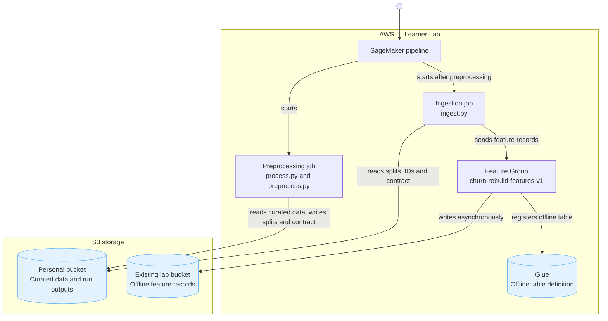

```mermaid
flowchart TB
    Start@{ shape: start }
    subgraph AWS["AWS — Learner Lab"]
        Pipeline["SageMaker pipeline"]
        Process["Preprocessing job<br/>process.py and preprocess.py"]
        Ingest["Ingestion job<br/>ingest.py"]
        Group["Feature Group<br/>churn-rebuild-features-v1"]
        Glue[("Glue<br/>Offline table definition")]
    end
    subgraph Storage["S3 storage"]
        Personal[("Personal bucket<br/>Curated data and run outputs")]
        Offline[("Existing lab bucket<br/>Offline feature records")]
    end
    Start --> Pipeline
    Pipeline -->|starts| Process
    Pipeline -->|starts after preprocessing| Ingest
    Process -->|reads curated data, writes splits and contract| Personal
    Ingest -->|reads splits, IDs and contract| Personal
    Ingest -->|sends feature records| Group
    Group -->|writes asynchronously| Offline
    Group -->|registers offline table| Glue
    classDef dataStore fill:#E3F2FD,stroke:#64B5F6
    class Personal,Offline,Glue dataStore
```
