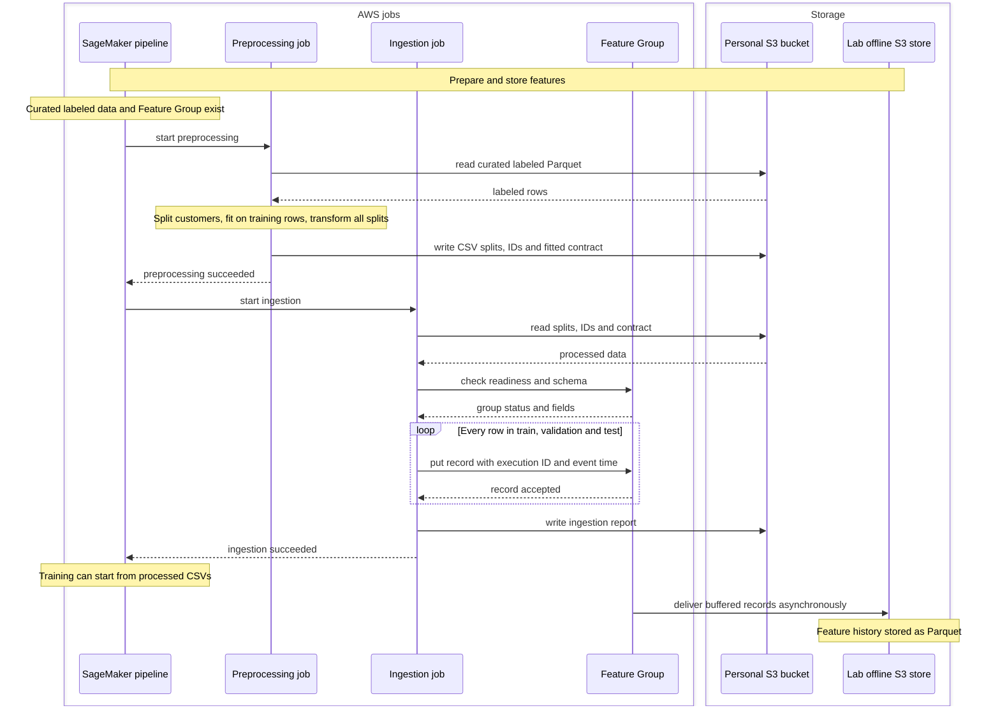

```mermaid
sequenceDiagram
    box AWS jobs
        participant Pipeline as SageMaker pipeline
        participant Process as Preprocessing job
        participant Ingest as Ingestion job
        participant Group as Feature Group
    end
    box Storage
        participant Personal as Personal S3 bucket
        participant Offline as Lab offline S3 store
    end
    Note over Pipeline,Offline: Prepare and store features
    Note over Pipeline: Curated labeled data and Feature Group exist
    Pipeline->>Process: start preprocessing
    Process->>Personal: read curated labeled Parquet
    Personal-->>Process: labeled rows
    Note over Process: Split customers, fit on training rows, transform all splits
    Process->>Personal: write CSV splits, IDs and fitted contract
    Process-->>Pipeline: preprocessing succeeded
    Pipeline->>Ingest: start ingestion
    Ingest->>Personal: read splits, IDs and contract
    Personal-->>Ingest: processed data
    Ingest->>Group: check readiness and schema
    Group-->>Ingest: group status and fields
    loop Every row in train, validation and test
        Ingest->>Group: put record with execution ID and event time
        Group-->>Ingest: record accepted
    end
    Ingest->>Personal: write ingestion report
    Ingest-->>Pipeline: ingestion succeeded
    Note over Pipeline: Training can start from processed CSVs
    Group->>Offline: deliver buffered records asynchronously
    Note over Offline: Feature history stored as Parquet
```
