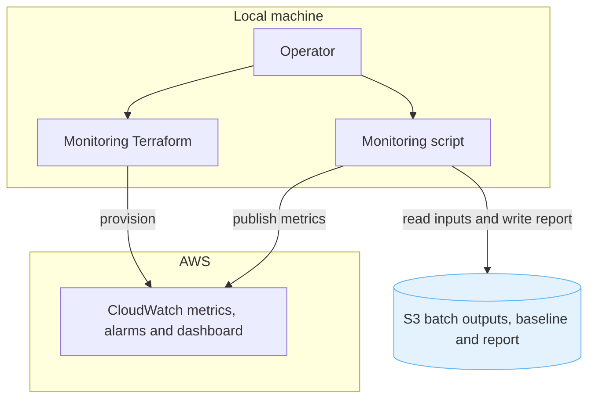

```mermaid
flowchart TB
    subgraph Local["Local machine"]
        Operator["Operator"]
        Terraform["Monitoring Terraform"]
        Script["Monitoring script"]
    end
    subgraph AWS["AWS"]
        CloudWatch["CloudWatch metrics, alarms and dashboard"]
    end
    S3[("S3 batch outputs, baseline and report")]
    Operator --> Terraform
    Operator --> Script
    Terraform -->|provision| CloudWatch
    Script -->|publish metrics| CloudWatch
    Script -->|read inputs and write report| S3
    classDef dataStore fill:#E3F2FD,stroke:#64B5F6
    class S3 dataStore
```
