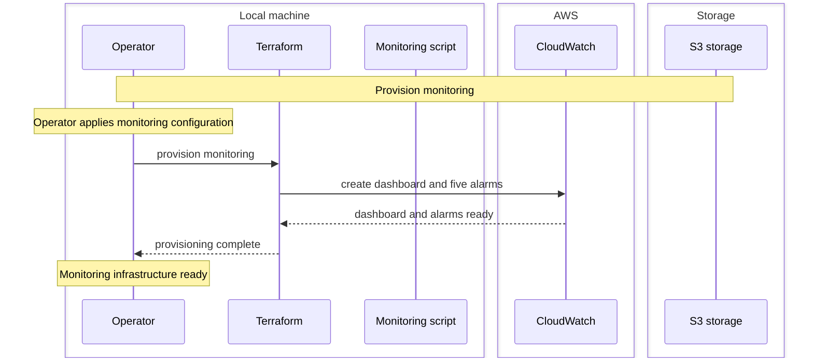

```mermaid
sequenceDiagram
    box Local machine
        participant Operator
        participant Terraform
        participant Monitor as Monitoring script
    end
    box AWS
        participant CW as CloudWatch
    end
    box Storage
        participant S3 as S3 storage
    end
    Note over Operator,S3: Provision monitoring
    Note over Operator: Operator applies monitoring configuration
    Operator->>Terraform: provision monitoring
    Terraform->>CW: create dashboard and five alarms
    CW-->>Terraform: dashboard and alarms ready
    Terraform-->>Operator: provisioning complete
    Note over Operator: Monitoring infrastructure ready
```
