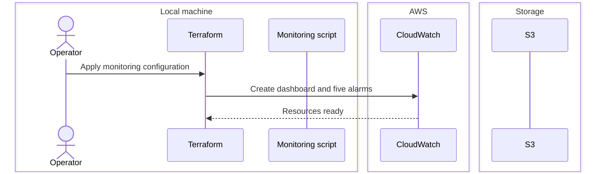

```mermaid
sequenceDiagram
    box Local machine
        actor Operator
        participant Terraform
        participant Monitor as Monitoring script
    end
    box AWS
        participant CW as CloudWatch
    end
    box Storage
        participant S3
    end
    Operator->>Terraform: Apply monitoring configuration
    Terraform->>CW: Create dashboard and five alarms
    CW-->>Terraform: Resources ready
```
