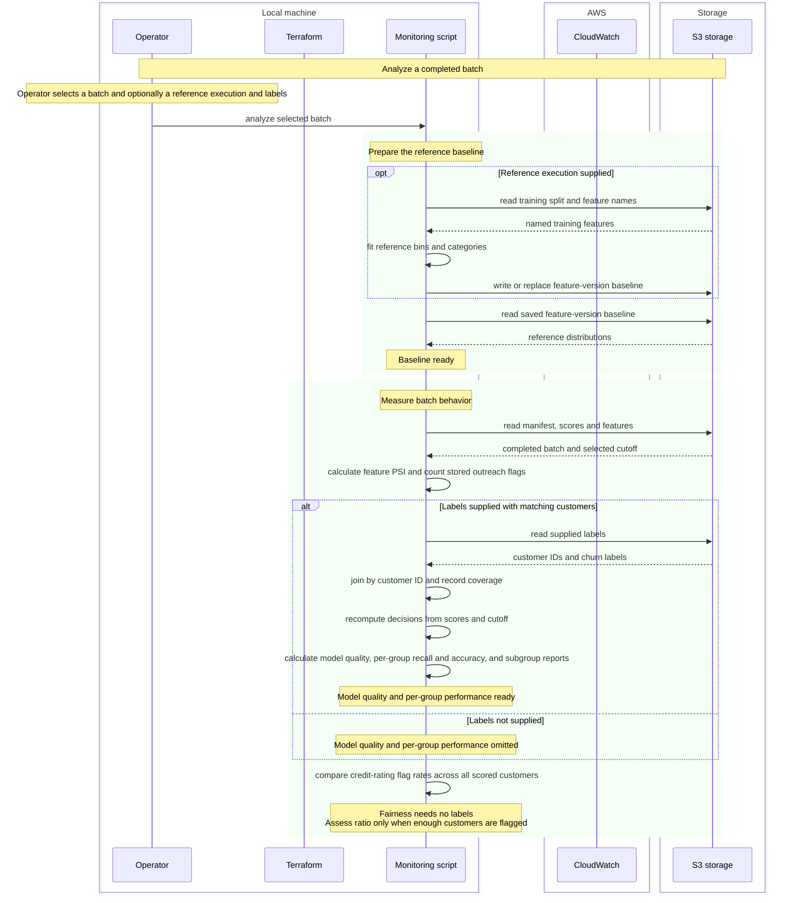

```mermaid
sequenceDiagram
    box Local machine
        participant Operator
        participant Terraform
        participant Monitor as Monitoring script
    end
    box AWS
        participant CW as CloudWatch
    end
    box Storage
        participant S3 as S3 storage
    end
    Note over Operator,S3: Analyze a completed batch
    Note over Operator: Operator selects a batch and optionally a reference execution and labels
    Operator->>Monitor: analyze selected batch
    rect rgb(245, 255, 245)
        Note over Monitor: Prepare the reference baseline
        opt Reference execution supplied
            Monitor->>S3: read training split and feature names
            S3-->>Monitor: named training features
            Monitor->>Monitor: fit reference bins and categories
            Monitor->>S3: write or replace feature-version baseline
        end
        Monitor->>S3: read saved feature-version baseline
        S3-->>Monitor: reference distributions
        Note over Monitor: Baseline ready
    end
    rect rgb(245, 255, 245)
        Note over Monitor: Measure batch behavior
        Monitor->>S3: read manifest, scores and features
        S3-->>Monitor: completed batch and selected cutoff
        Monitor->>Monitor: calculate feature PSI and count stored outreach flags
        alt Labels supplied with matching customers
            Monitor->>S3: read supplied labels
            S3-->>Monitor: customer IDs and churn labels
            Monitor->>Monitor: join by customer ID and record coverage
            Monitor->>Monitor: recompute decisions from scores and cutoff
            Monitor->>Monitor: calculate model quality, per-group recall and accuracy, and subgroup reports
            Note over Monitor: Model quality and per-group performance ready
        else Labels not supplied
            Note over Monitor: Model quality and per-group performance omitted
        end
        Monitor->>Monitor: compare credit-rating flag rates across all scored customers
        Note over Monitor: Fairness needs no labels<br/>Assess ratio only when enough customers are flagged
    end
```
