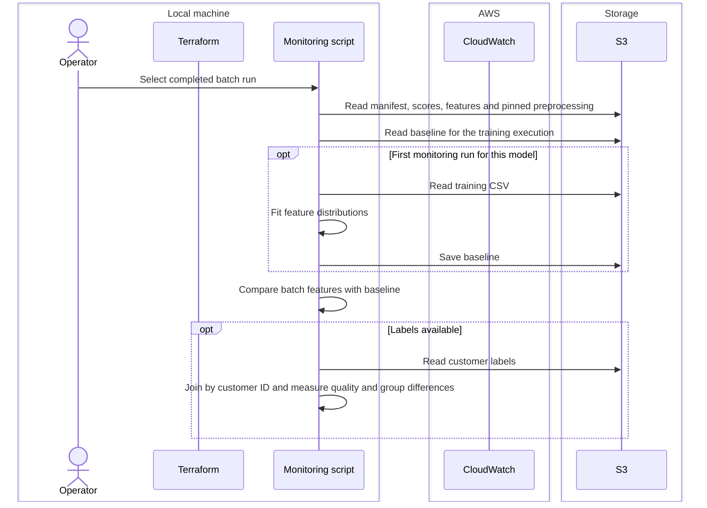

```mermaid
sequenceDiagram
    box Local machine
        actor Operator
        participant Terraform
        participant Monitor as Monitoring script
    end
    box AWS
        participant CW as CloudWatch
    end
    box Storage
        participant S3
    end
    Operator->>Monitor: Select completed batch run
    Monitor->>S3: Read manifest, scores, features and pinned preprocessing
    Monitor->>S3: Read baseline for the training execution
    opt First monitoring run for this model
        Monitor->>S3: Read training CSV
        Monitor->>Monitor: Fit feature distributions
        Monitor->>S3: Save baseline
    end
    Monitor->>Monitor: Compare batch features with baseline
    opt Labels available
        Monitor->>S3: Read customer labels
        Monitor->>Monitor: Join by customer ID and measure quality and group differences
    end
```
