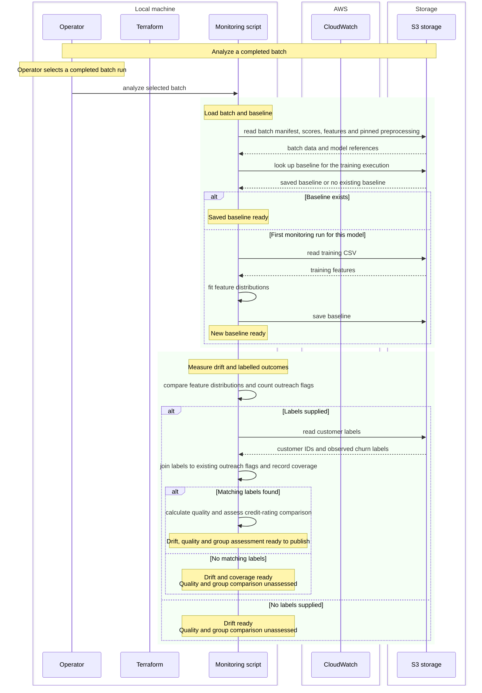

```mermaid
sequenceDiagram
    box Local machine
        participant Operator
        participant Terraform
        participant Monitor as Monitoring script
    end
    box AWS
        participant CW as CloudWatch
    end
    box Storage 
        participant S3 as S3 storage
    end
    Note over Operator,S3: Analyze a completed batch
    Note over Operator: Operator selects a completed batch run
    Operator->>Monitor: analyze selected batch
    rect rgb(245, 255, 245)
        Note over Monitor: Load batch and baseline
        Monitor->>S3: read batch manifest, scores, features and pinned preprocessing
        S3-->>Monitor: batch data and model references
        Monitor->>S3: look up baseline for the training execution
        S3-->>Monitor: saved baseline or no existing baseline
        alt Baseline exists
            Note over Monitor: Saved baseline ready
        else First monitoring run for this model
            Monitor->>S3: read training CSV
            S3-->>Monitor: training features
            Monitor->>Monitor: fit feature distributions
            Monitor->>S3: save baseline
            Note over Monitor: New baseline ready
        end
    end
    rect rgb(245, 255, 245)
        Note over Monitor: Measure drift and labelled outcomes
        Monitor->>Monitor: compare feature distributions and count outreach flags
        alt Labels supplied
            Monitor->>S3: read customer labels
            S3-->>Monitor: customer IDs and observed churn labels
            Monitor->>Monitor: join labels to existing outreach flags and record coverage
            alt Matching labels found
                Monitor->>Monitor: calculate quality and assess credit-rating comparison
                Note over Monitor: Drift, quality and group assessment ready to publish
            else No matching labels
                Note over Monitor: Drift and coverage ready<br/>Quality and group comparison unassessed
            end
        else No labels supplied
            Note over Monitor: Drift ready<br/>Quality and group comparison unassessed
        end
    end
```
