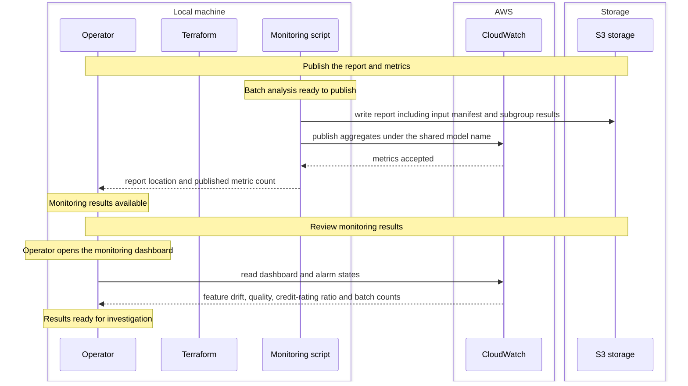

```mermaid
sequenceDiagram
    box Local machine
        participant Operator
        participant Terraform
        participant Monitor as Monitoring script
    end
    box AWS
        participant CW as CloudWatch
    end
    box Storage
        participant S3 as S3 storage
    end
    Note over Operator,S3: Publish the report and metrics
    Note over Monitor: Batch analysis ready to publish
    Monitor->>S3: write report including input manifest and subgroup results
    Monitor->>CW: publish aggregates under the shared model name
    CW-->>Monitor: metrics accepted
    Monitor-->>Operator: report location and published metric count
    Note over Operator: Monitoring results available

    Note over Operator,S3: Review monitoring results
    Note over Operator: Operator opens the monitoring dashboard
    Operator->>CW: read dashboard and alarm states
    CW-->>Operator: feature drift, quality, credit-rating ratio and batch counts
    Note over Operator: Results ready for investigation
```
