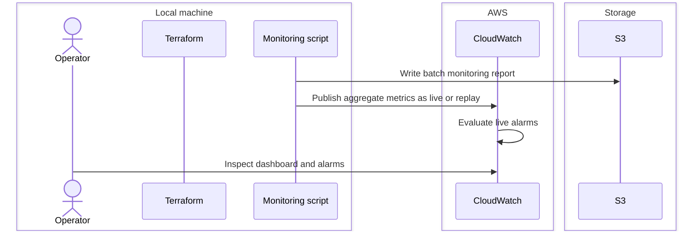

```mermaid
sequenceDiagram
    box Local machine
        actor Operator
        participant Terraform
        participant Monitor as Monitoring script
    end
    box AWS
        participant CW as CloudWatch
    end
    box Storage
        participant S3
    end
    Monitor->>S3: Write batch monitoring report
    Monitor->>CW: Publish aggregate metrics as live or replay
    CW->>CW: Evaluate live alarms
    Operator->>CW: Inspect dashboard and alarms
```
