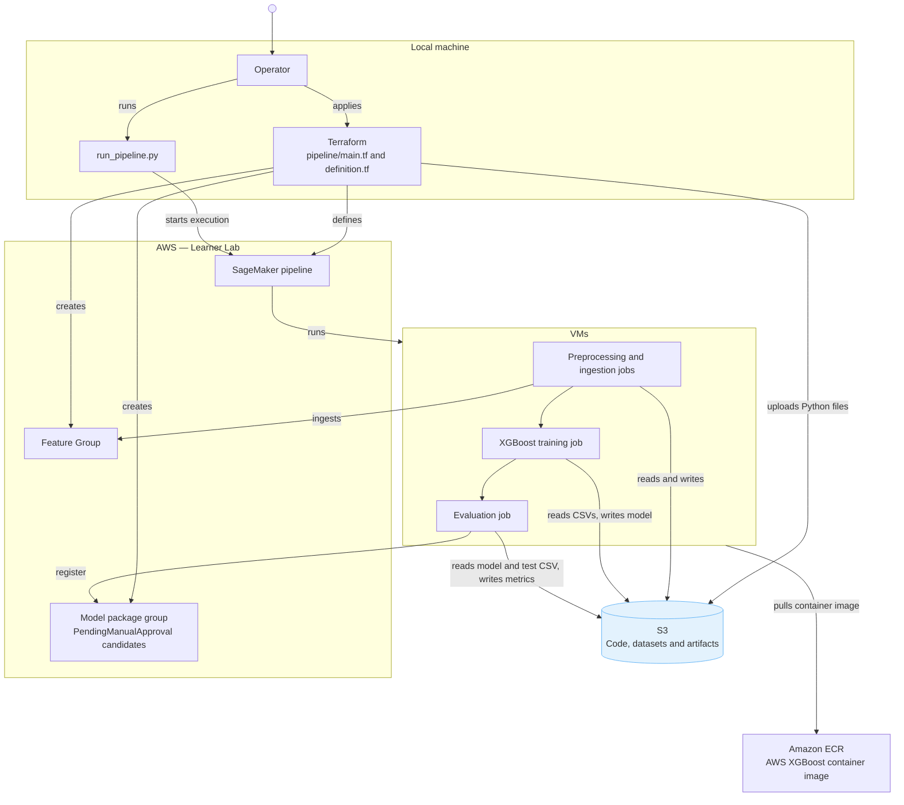

```mermaid
flowchart TB

subgraph VMs
direction LR
    Preparation["Preprocessing and ingestion jobs"]
    Training["XGBoost training job"]
    Evaluation["Evaluation job"]

    Preparation --> Training 
    Training --> Evaluation

 
end
Start@{ shape: start }
subgraph Local["Local machine"]
    Operator["Operator"]
    Terraform["Terraform<br/>pipeline/main.tf and definition.tf"]
    Launcher["run_pipeline.py"]
end   
subgraph AWS["AWS — Learner Lab"]
    Pipeline["SageMaker pipeline"]
    FeatureGroup["Feature Group"]
    
    Registry["Model package group<br/>PendingManualApproval candidates"]
end

ECR["Amazon ECR<br/>AWS XGBoost container image"]


S3[("S3<br/>Code, datasets and artifacts")]
Start --> Operator
Operator -->|applies| Terraform
Operator -->|runs| Launcher
Terraform -->|uploads Python files| S3
Terraform -->|defines| Pipeline
Terraform -->|creates| FeatureGroup
Terraform -->|creates| Registry
Launcher -->|starts execution| Pipeline
Preparation -->|ingests| FeatureGroup
Pipeline -->|runs| VMs
Evaluation -->|register| Registry
VMs ------>|pulls container image| ECR
Preparation -->|reads and writes| S3
Training -->|reads CSVs, writes model| S3
Evaluation -->|reads model and test CSV, writes metrics| S3
classDef dataStore fill:#E3F2FD,stroke:#64B5F6
class S3 dataStore
```
