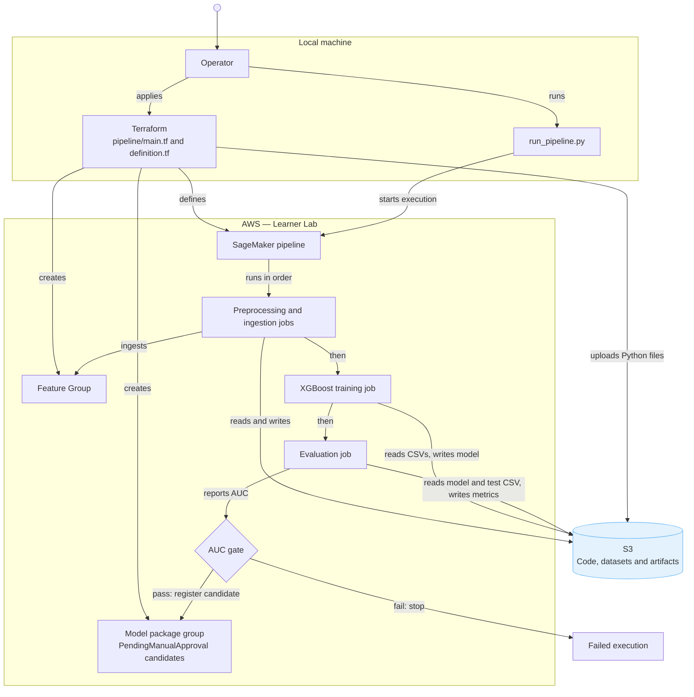

```mermaid
flowchart TB
    Start@{ shape: start }
    subgraph Local["Local machine"]
        Operator["Operator"]
        Terraform["Terraform<br/>pipeline/main.tf and definition.tf"]
        Launcher["run_pipeline.py"]
    end
    subgraph AWS["AWS — Learner Lab"]
        Pipeline["SageMaker pipeline"]
        Preparation["Preprocessing and ingestion jobs"]
        FeatureGroup["Feature Group"]
        Training["XGBoost training job"]
        Evaluation["Evaluation job"]
        Gate{"AUC gate"}
        Registry["Model package group<br/>PendingManualApproval candidates"]
    end
    S3[("S3<br/>Code, datasets and artifacts")]
    Start --> Operator
    Operator -->|applies| Terraform
    Operator -->|runs| Launcher
    Terraform -->|uploads Python files| S3
    Terraform -->|defines| Pipeline
    Terraform -->|creates| FeatureGroup
    Terraform -->|creates| Registry
    Launcher -->|starts execution| Pipeline
    Pipeline -->|runs in order| Preparation
    Preparation -->|ingests| FeatureGroup
    Preparation -->|then| Training
    Training -->|then| Evaluation
    Evaluation -->|reports AUC| Gate
    Gate -->|pass: register candidate| Registry
    Gate -->|fail: stop| Failed["Failed execution"]
    Preparation -->|reads and writes| S3
    Training -->|reads CSVs, writes model| S3
    Evaluation -->|reads model and test CSV, writes metrics| S3
    classDef dataStore fill:#E3F2FD,stroke:#64B5F6
    class S3 dataStore
```
