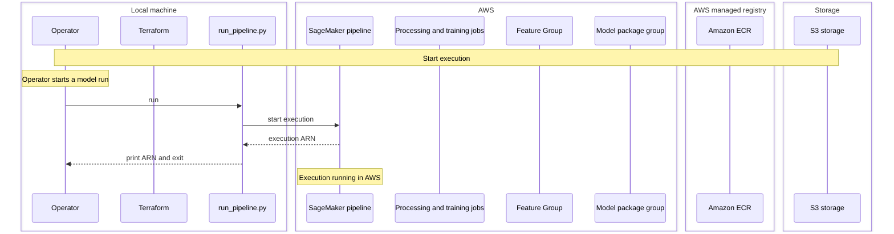

```mermaid
sequenceDiagram
    box Local machine
        participant Operator
        participant Terraform
        participant Launcher as run_pipeline.py
    end
    box AWS
        participant Pipeline as SageMaker pipeline
        participant Jobs as Processing and training jobs
        participant Group as Feature Group
        participant Registry as Model package group
    end
    box AWS managed registry
        participant ECR as Amazon ECR
    end
    box Storage
        participant S3 as S3 storage
    end
    Note over Operator,S3: Start execution
    Note over Operator: Operator starts a model run
    Operator->>Launcher: run
    Launcher->>Pipeline: start execution
    Pipeline-->>Launcher: execution ARN
    Launcher-->>Operator: print ARN and exit
    Note over Pipeline: Execution running in AWS
```
