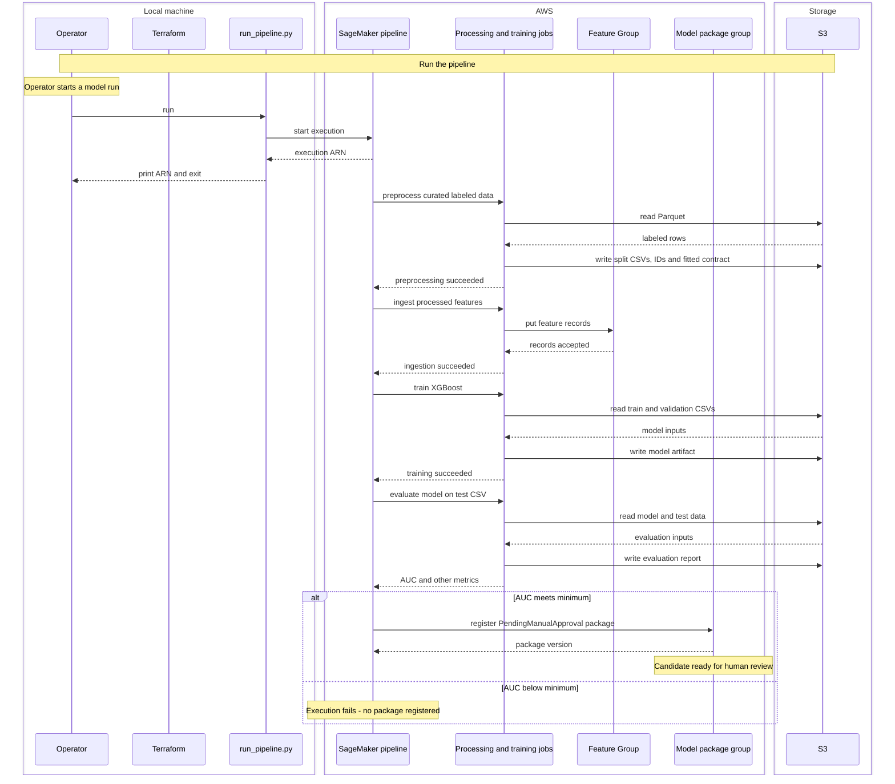

```mermaid
sequenceDiagram
    box Local machine
        participant Operator
        participant Terraform
        participant Launcher as run_pipeline.py
    end
    box AWS
        participant Pipeline as SageMaker pipeline
        participant Jobs as Processing and training jobs
        participant Group as Feature Group
        participant Registry as Model package group 
    end
    box Storage
        participant S3
    end
    Note over Operator,S3: Run the pipeline
    Note over Operator: Operator starts a model run
    Operator->>Launcher: run
    Launcher->>Pipeline: start execution
    Pipeline-->>Launcher: execution ARN
    Launcher-->>Operator: print ARN and exit
    Pipeline->>Jobs: preprocess curated labeled data
    Jobs->>S3: read Parquet
    S3-->>Jobs: labeled rows
    Jobs->>S3: write split CSVs, IDs and fitted contract
    Jobs-->>Pipeline: preprocessing succeeded
    Pipeline->>Jobs: ingest processed features
    Jobs->>Group: put feature records
    Group-->>Jobs: records accepted
    Jobs-->>Pipeline: ingestion succeeded
    Pipeline->>Jobs: train XGBoost
    Jobs->>S3: read train and validation CSVs
    S3-->>Jobs: model inputs
    Jobs->>S3: write model artifact
    Jobs-->>Pipeline: training succeeded
    Pipeline->>Jobs: evaluate model on test CSV
    Jobs->>S3: read model and test data
    S3-->>Jobs: evaluation inputs
    Jobs->>S3: write evaluation report
    Jobs-->>Pipeline: AUC and other metrics
    alt AUC meets minimum
        Pipeline->>Registry: register PendingManualApproval package
        Registry-->>Pipeline: package version
        Note over Registry: Candidate ready for human review
    else AUC below minimum
        Note over Pipeline: Execution fails - no package registered
    end
```
