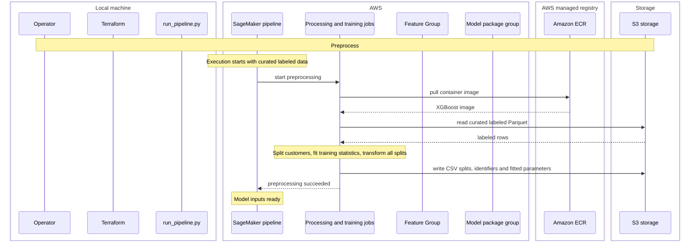

```mermaid
sequenceDiagram
    box Local machine
        participant Operator
        participant Terraform
        participant Launcher as run_pipeline.py
    end
    box AWS
        participant Pipeline as SageMaker pipeline
        participant Jobs as Processing and training jobs
        participant Group as Feature Group
        participant Registry as Model package group
    end
    box AWS managed registry
        participant ECR as Amazon ECR
    end
    box Storage
        participant S3 as S3 storage
    end
    Note over Operator,S3: Preprocess
    Note over Pipeline: Execution starts with curated labeled data
    Pipeline->>Jobs: start preprocessing
    Jobs->>ECR: pull container image
    ECR-->>Jobs: XGBoost image
    Jobs->>S3: read curated labeled Parquet
    S3-->>Jobs: labeled rows
    Note over Jobs: Split customers, fit training statistics, transform all splits
    Jobs->>S3: write CSV splits, identifiers and fitted parameters
    Jobs-->>Pipeline: preprocessing succeeded
    Note over Pipeline: Model inputs ready
```
