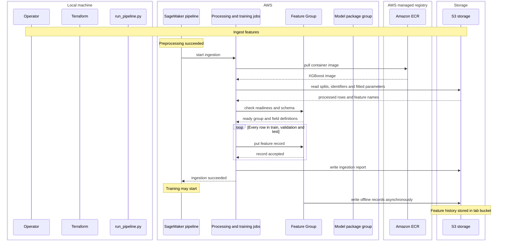

```mermaid
sequenceDiagram
    box Local machine
        participant Operator
        participant Terraform
        participant Launcher as run_pipeline.py
    end
    box AWS
        participant Pipeline as SageMaker pipeline
        participant Jobs as Processing and training jobs
        participant Group as Feature Group
        participant Registry as Model package group
    end
    box AWS managed registry
        participant ECR as Amazon ECR
    end
    box Storage
        participant S3 as S3 storage
    end
    Note over Operator,S3: Ingest features
    Note over Pipeline: Preprocessing succeeded
    Pipeline->>Jobs: start ingestion
    Jobs->>ECR: pull container image
    ECR-->>Jobs: XGBoost image
    Jobs->>S3: read splits, identifiers and fitted parameters
    S3-->>Jobs: processed rows and feature names
    Jobs->>Group: check readiness and schema
    Group-->>Jobs: ready group and field definitions
    loop Every row in train, validation and test
        Jobs->>Group: put feature record
        Group-->>Jobs: record accepted
    end
    Jobs->>S3: write ingestion report
    Jobs-->>Pipeline: ingestion succeeded
    Note over Pipeline: Training may start
    Group->>S3: write offline records asynchronously
    Note over S3: Feature history stored in lab bucket
```
