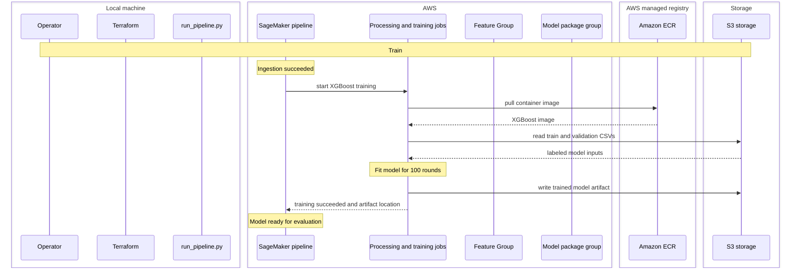

```mermaid
sequenceDiagram
    box Local machine
        participant Operator
        participant Terraform
        participant Launcher as run_pipeline.py
    end
    box AWS
        participant Pipeline as SageMaker pipeline
        participant Jobs as Processing and training jobs
        participant Group as Feature Group
        participant Registry as Model package group
    end
    box AWS managed registry
        participant ECR as Amazon ECR
    end
    box Storage
        participant S3 as S3 storage
    end
    Note over Operator,S3: Train
    Note over Pipeline: Ingestion succeeded
    Pipeline->>Jobs: start XGBoost training
    Jobs->>ECR: pull container image
    ECR-->>Jobs: XGBoost image
    Jobs->>S3: read train and validation CSVs
    S3-->>Jobs: labeled model inputs
    Note over Jobs: Fit model for 100 rounds
    Jobs->>S3: write trained model artifact
    Jobs-->>Pipeline: training succeeded and artifact location
    Note over Pipeline: Model ready for evaluation
```
