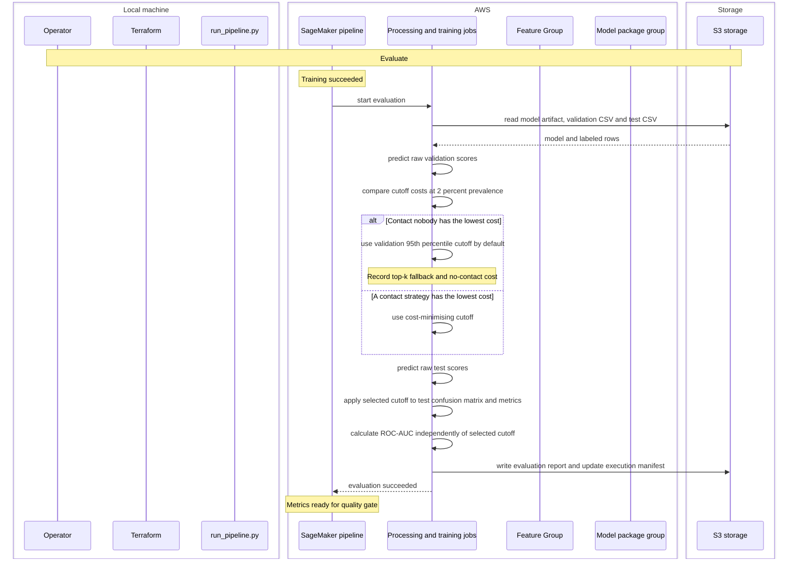

```mermaid
sequenceDiagram
    box Local machine
        participant Operator
        participant Terraform
        participant Launcher as run_pipeline.py
    end
    box AWS
        participant Pipeline as SageMaker pipeline
        participant Jobs as Processing and training jobs
        participant Group as Feature Group
        participant Registry as Model package group
    end
    box Storage
        participant S3 as S3 storage
    end
    Note over Operator,S3: Evaluate
    Note over Pipeline: Training succeeded
    Pipeline->>Jobs: start evaluation
    Jobs->>S3: read model artifact, validation CSV and test CSV
    S3-->>Jobs: model and labeled rows
    Jobs->>Jobs: predict raw validation scores
    Jobs->>Jobs: compare cutoff costs at 2 percent prevalence
    alt Contact nobody has the lowest cost
        Jobs->>Jobs: use validation 95th percentile cutoff by default
        Note over Jobs: Record top-k fallback and no-contact cost
    else A contact strategy has the lowest cost
        Jobs->>Jobs: use cost-minimising cutoff
    end
    Jobs->>Jobs: predict raw test scores
    Jobs->>Jobs: apply selected cutoff to test confusion matrix and metrics
    Jobs->>Jobs: calculate ROC-AUC independently of selected cutoff
    Jobs->>S3: write evaluation report and update execution manifest
    Jobs-->>Pipeline: evaluation succeeded
    Note over Pipeline: Metrics ready for quality gate
```
