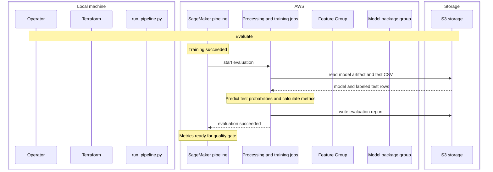

```mermaid
sequenceDiagram
    box Local machine
        participant Operator
        participant Terraform
        participant Launcher as run_pipeline.py
    end
    box AWS
        participant Pipeline as SageMaker pipeline
        participant Jobs as Processing and training jobs
        participant Group as Feature Group
        participant Registry as Model package group
    end
    box Storage
        participant S3 as S3 storage
    end
    Note over Operator,S3: Evaluate
    Note over Pipeline: Training succeeded
    Pipeline->>Jobs: start evaluation
    Jobs->>S3: read model artifact and test CSV
    S3-->>Jobs: model and labeled test rows
    Note over Jobs: Predict test probabilities and calculate metrics
    Jobs->>S3: write evaluation report
    Jobs-->>Pipeline: evaluation succeeded
    Note over Pipeline: Metrics ready for quality gate
```
