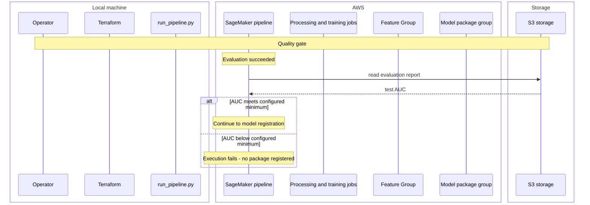

```mermaid
sequenceDiagram
    box Local machine
        participant Operator
        participant Terraform
        participant Launcher as run_pipeline.py
    end
    box AWS 
        participant Pipeline as SageMaker pipeline
        participant Jobs as Processing and training jobs
        participant Group as Feature Group
        participant Registry as Model package group
    end
    box Storage
        participant S3 as S3 storage
    end
    Note over Operator,S3: Quality gate
    Note over Pipeline: Evaluation succeeded
    Pipeline->>S3: read evaluation report
    S3-->>Pipeline: test AUC
    alt AUC meets configured minimum
        Note over Pipeline: Continue to model registration
    else AUC below configured minimum
        Note over Pipeline: Execution fails - no package registered
    end
```
