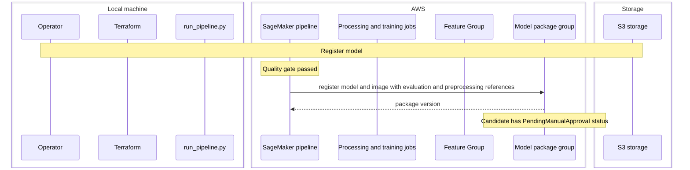

```mermaid
sequenceDiagram
    box Local machine
        participant Operator
        participant Terraform
        participant Launcher as run_pipeline.py
    end
    box AWS 
        participant Pipeline as SageMaker pipeline
        participant Jobs as Processing and training jobs
        participant Group as Feature Group
        participant Registry as Model package group
    end 
    box Storage
        participant S3 as S3 storage
    end
    Note over Operator,S3: Register model
    Note over Pipeline: Quality gate passed
    Pipeline->>Registry: register model and image with evaluation and preprocessing references
    Registry-->>Pipeline: package version
    Note over Registry: Candidate has PendingManualApproval status
```
