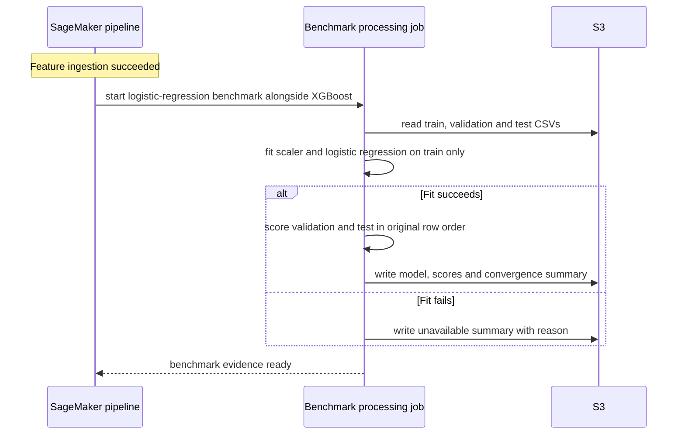

```mermaid
sequenceDiagram
    participant Pipeline as SageMaker pipeline
    participant Baseline as Benchmark processing job
    participant S3
    Note over Pipeline: Feature ingestion succeeded
    Pipeline->>Baseline: start logistic-regression benchmark alongside XGBoost
    Baseline->>S3: read train, validation and test CSVs
    Baseline->>Baseline: fit scaler and logistic regression on train only
    alt Fit succeeds
        Baseline->>Baseline: score validation and test in original row order
        Baseline->>S3: write model, scores and convergence summary
    else Fit fails
        Baseline->>S3: write unavailable summary with reason
    end
    Baseline-->>Pipeline: benchmark evidence ready
```
