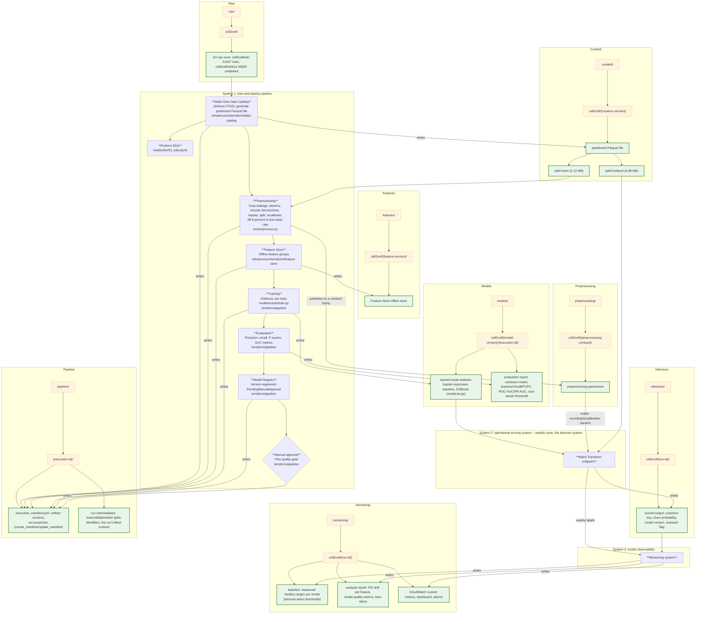

```mermaid
flowchart TB
    subgraph BUILD["System 1: train-and-deploy pipeline"]
        Cat["**Make Glue Data Catalog**<br/>(Athena CTAS), generate partitioned Parquet file<br/>infrastructure/terraform/data-catalog"]
        EDA["**Perform EDA**<br/>notebooks/02_eda.ipynb"]
        Proc["**Preprocessing**<br/>Drop leakage columns, encode ServiceArea, impute, split, recalibrate 28.8 percent to true base rate<br/>src/preprocess.py"]
        FS["**Feature Store**<br/>Offline feature groups<br/>infrastructure/terraform/feature-store"]
        Train["**Training**<br/>XGBoost, per train-model/scripts/train.py<br/>terraform/pipeline"]
        Eval["**Evaluation**<br/>Precision, recall, F-scores, AUC metrics<br/>terraform/pipeline"]
        RegV["**Model Registry**<br/>Version registered PendingManualApproval<br/>terraform/pipeline"]
        Gate{"**Manual approval**<br/>Plus quality gate<br/>terraform/pipeline"}
    end

    subgraph Raw
        Praw["raw/"]
        Praw --> PrawC["cell2cell/"]
        PrawC --> RawArt["S3 raw zone: cell2celltrain 51047 rows, cell2cellholdout 20000 unlabeled"]
    end

    subgraph Curated
        Pcur["curated/"]
        Pcur --> PcurV["cell2cell/{curation-version}/"]
        PcurV --> PcurArt["partitioned Parquet file"]
        PcurArt --> PcurTrain["split=train/ (2.12 MB)"]
        PcurArt --> PcurHold["split=holdout/ (0.89 MB)"]
    end

    subgraph Features
        Pfeat["features/"]
        Pfeat --> PfeatV["cell2cell/{feature-version}/"]
        PfeatV --> PfeatStoreArt["Feature Store offline store"]
    end

    subgraph Preprocessing
        Ppre["preprocessing/"]
        Ppre --> PpreV["cell2cell/{preprocessing-contract}/"]
        PpreV --> PmodelsPreproc["preprocessing parameters"]
    end

    subgraph Models
        Pmodels["models/"]
        Pmodels --> PmodelsV["cell2cell/{model-version}/{execution-id}/"]
        PmodelsV --> PmodelsModelArt["trained model artifacts:<br/>logistic-regression baseline, XGBoost (model.tar.gz)"]
        PmodelsV --> PmodelsEvalArt["evaluation report: confusion matrix,<br/>precision/recall/F1/F2, ROC-AUC/PR-AUC, cost-aware threshold"]
    end

    subgraph Inference
        Pinf["inference/"]
        Pinf --> PinfR["cell2cell/{run-id}/"]
        PinfR --> PinfOutArt["scored output: customer key, churn probability,<br/>model version, outreach flag"]
    end

    subgraph Monitoring
        Pmon["monitoring/"]
        Pmon --> PmonR["cell2cell/{run-id}/"]
        PmonR --> PmonBaseline["baseline: measured healthy ranges per model<br/>(become alarm thresholds)"]
        PmonR --> PmonAnalysis["analysis report: PSI drift per feature,<br/>model quality metrics, bias slices"]
        PmonR --> PmonCloudWatch["CloudWatch custom metrics, dashboard, alarms"]
    end

    subgraph Pipeline
        Ppipe["pipeline/"]
        Ppipe --> PpipeE["{execution-id}/"]
        PpipeE --> PpipeManifest["execution_manifest.json: artifact versions,<br/>run properties (create_manifest/update_manifest)"]
        PpipeE --> PpipeIntermediates["run intermediates: train/validation/test splits,<br/>identifiers, the run's fitted contract"]
    end

    subgraph SERVE["System 2: operational serving system -- weekly cycle, the demoed system"]
        BatchT["**Batch Transform endpoint**"]
    end

    subgraph OBS["System 3: model observability"]
        MonSys["**Monitoring system**"]
    end

    Cat --> Proc --> FS --> Train --> Eval --> RegV --> Gate
    BatchT -->|weekly labels| MonSys

    RawArt --> Cat
    Cat -->|writes| PcurArt
    Cat -->|writes| PpipeManifest
    Cat --> EDA
    PcurTrain --> Proc
    Proc -->|publishes on a contract bump| PmodelsPreproc
    Proc -->|writes| PpipeManifest
    FS -->|writes| PfeatStoreArt
    FS -->|writes| PpipeManifest
    Train -->|writes| PmodelsModelArt
    Train -->|writes| PpipeManifest
    Eval -->|writes| PmodelsEvalArt
    PmodelsModelArt --> BatchT
    PmodelsPreproc -->|reads: encoding/recalibration params| BatchT
    PcurHold --> BatchT
    BatchT -->|writes| PinfOutArt
    PinfOutArt --> MonSys
    MonSys -->|writes| PmonBaseline
    MonSys -->|writes| PmonAnalysis
    MonSys -->|writes| PmonCloudWatch
    RegV -->|writes| PpipeManifest
    Gate -->|writes| PpipeManifest

    classDef confirmedFolder fill:#fff3e0,stroke:#f57c00,stroke-width:1px,stroke-dasharray: 4 4
    classDef artifactStyle fill:#e8f5e9,stroke:#2e7d32,stroke-width:2px

    class Praw,PrawC,Pcur,PcurV,Ppre,PpreV,Pfeat,PfeatV,Pmodels,PmodelsV,Pinf,PinfR,Pmon,PmonR,Ppipe,PpipeE confirmedFolder
    class RawArt,PcurArt,PfeatStoreArt,PmodelsPreproc,PmodelsModelArt,PmodelsEvalArt,PpipeManifest,PpipeIntermediates,PinfOutArt,PmonBaseline,PmonAnalysis,PmonCloudWatch,PcurTrain,PcurHold artifactStyle
```
