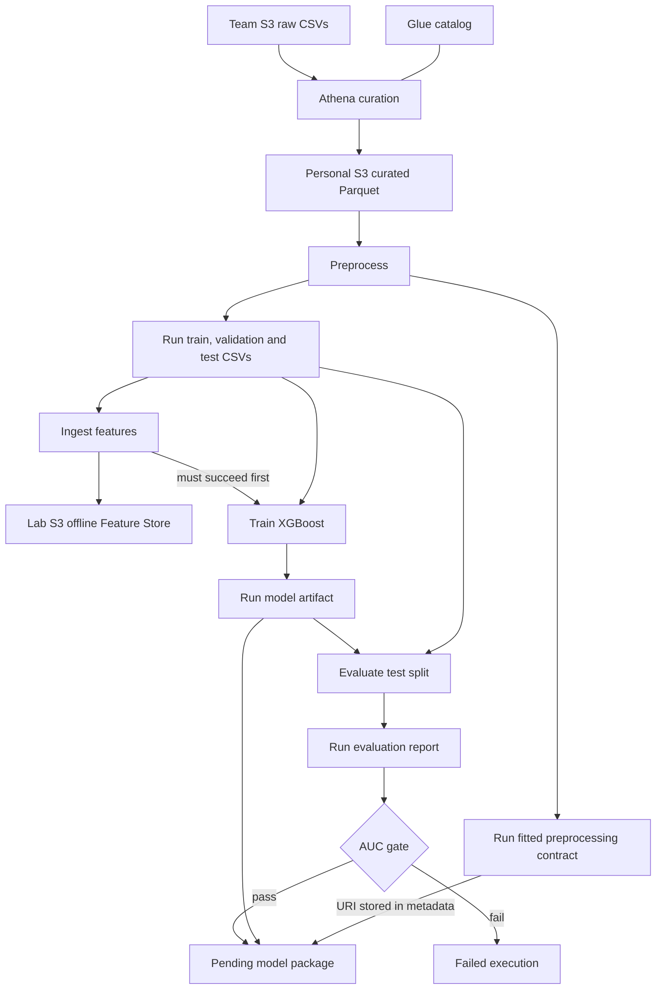

```mermaid
flowchart TB
    Raw["Team S3 raw CSVs"] --> Curation["Athena curation"]
    Glue["Glue catalog"] --- Curation
    Curation --> Curated["Personal S3 curated Parquet"]
    Curated --> Process["Preprocess"]
    Process --> Splits["Run train, validation and test CSVs"]
    Process --> Contract["Run fitted preprocessing contract"]
    Splits --> Ingest["Ingest features"]
    Ingest --> Offline["Lab S3 offline Feature Store"]
    Ingest -->|must succeed first| Train["Train XGBoost"]
    Splits --> Train
    Train --> Model["Run model artifact"]
    Model --> Eval["Evaluate test split"]
    Splits --> Eval
    Eval --> Report["Run evaluation report"]
    Report --> Gate{"AUC gate"}
    Gate -->|pass| Package["Pending model package"]
    Model --> Package
    Contract -->|URI stored in metadata| Package
    Gate -->|fail| Fail["Failed execution"]
```
