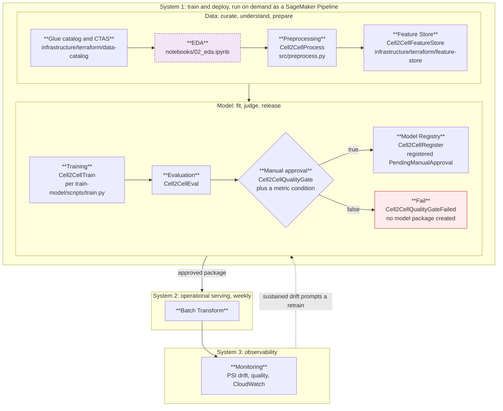

```mermaid
flowchart TB
    subgraph BUILD["System 1: train and deploy, run on demand as a SageMaker Pipeline"]
        direction TB
        subgraph DATA["Data: curate, understand, prepare"]
            direction LR
            Cat["**Glue catalog and CTAS**<br/>infrastructure/terraform/data-catalog"]
            EDA["**EDA**<br/>notebooks/02_eda.ipynb"]
            Proc["**Preprocessing**<br/>Cell2CellProcess<br/>src/preprocess.py"]
            FS["**Feature Store**<br/>Cell2CellFeatureStore<br/>infrastructure/terraform/feature-store"]

            Cat --> EDA --> Proc --> FS
        end

        subgraph MODEL["Model: fit, judge, release"]
            direction LR
            Train["**Training**<br/>Cell2CellTrain<br/>per train-model/scripts/train.py"]
            Eval["**Evaluation**<br/>Cell2CellEval"]
            RegV["**Model Registry**<br/>Cell2CellRegister<br/>registered PendingManualApproval"]
            Gate{"**Manual approval**<br/>Cell2CellQualityGate<br/>plus a metric condition"}

            Train --> Eval --> Gate
            Gate -->|true| RegV
            Gate -->|false| Failed["**Fail**<br/>Cell2CellQualityGateFailed<br/>no model package created"]
        end
    end

    subgraph SERVE["System 2: operational serving, weekly"]
        BatchT["**Batch Transform**"]
    end

    subgraph OBS["System 3: observability"]
        MonSys["**Monitoring**<br/>PSI drift, quality, CloudWatch"]
    end

    DATA --> MODEL
    MODEL -->|approved package| SERVE
    BatchT --> MonSys

    OBS -.->|sustained drift prompts a retrain| MODEL

    classDef human fill:#f3e5f5,stroke:#7b1fa2,stroke-dasharray: 3 3
    class EDA human
    classDef failed fill:#ffebee,stroke:#c62828
    class Failed failed
```
