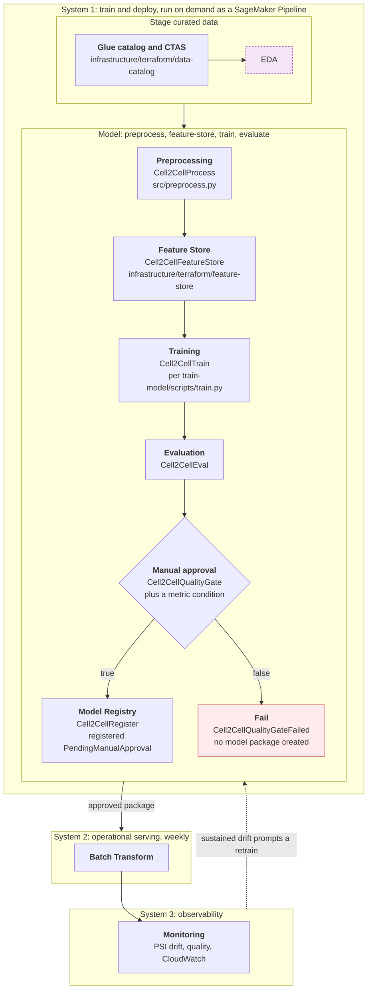

```mermaid
flowchart TB
    subgraph BUILD["System 1: train and deploy, run on demand as a SageMaker Pipeline"]
        direction TB
        subgraph STAGING["Stage curated data"]
            direction LR
            Cat["<strong>Glue catalog and CTAS</strong><br/>infrastructure/terraform/data-catalog"]
            Cat --> EDA
        end

        subgraph PIPELINE["Model: preprocess, feature-store, train, evaluate"]
            direction TB 
            Proc["<strong>Preprocessing</strong><br/>Cell2CellProcess<br/>src/preprocess.py"]
            FS["<strong>Feature Store</strong><br/>Cell2CellFeatureStore<br/>infrastructure/terraform/feature-store"]   
            Train["<strong>Training</strong><br/>Cell2CellTrain<br/>per train-model/scripts/train.py"]
            Eval["<strong>Evaluation</strong><br/>Cell2CellEval"]
            RegV["<strong>Model Registry</strong><br/>Cell2CellRegister<br/>registered PendingManualApproval"]
            Gate{"<strong>Manual approval</strong><br/>Cell2CellQualityGate<br/>plus a metric condition"}

            Proc --> FS
            FS --> Train
            Train --> Eval --> Gate
            Gate -->|true| RegV
            Gate -->|false| Failed["<strong>Fail</strong><br/>Cell2CellQualityGateFailed<br/>no model package created"]
        end
    end

    subgraph SERVE["System 2: operational serving, weekly"]
        BatchT["<strong>Batch Transform</strong>"]
    end

    subgraph OBS["System 3: observability"]
        MonSys["<strong>Monitoring</strong><br/>PSI drift, quality, CloudWatch"]
    end

    STAGING --> PIPELINE
    PIPELINE -->|approved package| SERVE
    BatchT --> MonSys

    OBS -.->|sustained drift prompts a retrain| PIPELINE

    classDef human fill:#f3e5f5,stroke:#7b1fa2,stroke-dasharray: 3 3
    class EDA human
    classDef failed fill:#ffebee,stroke:#c62828
    class Failed failed
```
