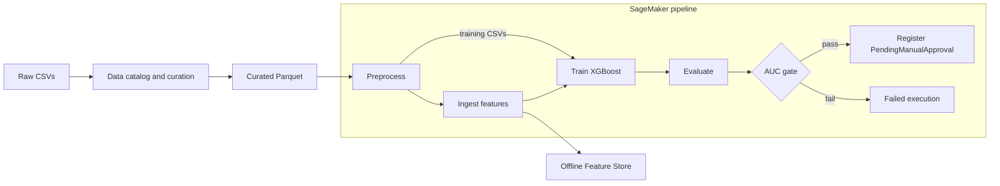

```mermaid
flowchart LR
    Raw["Raw CSVs"] --> Catalog["Data catalog and curation"]
    Catalog --> Curated["Curated Parquet"]
    subgraph Pipeline["SageMaker pipeline"]
        Process["Preprocess"] --> Ingest["Ingest features"]
        Ingest --> Train["Train XGBoost"] --> Eval["Evaluate"] --> Gate{"AUC gate"}
        Gate -->|pass| Register["Register PendingManualApproval"]
        Gate -->|fail| Fail["Failed execution"]
    end
    Curated --> Process
    Process -->|training CSVs| Train
    Ingest --> Offline["Offline Feature Store"]
```
