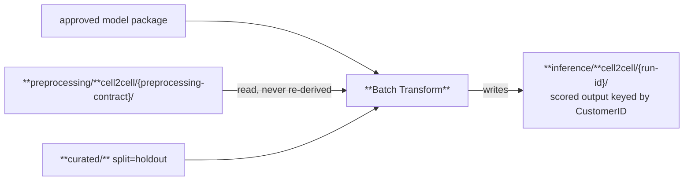

```mermaid
flowchart LR
    Pkg["approved model package"] --> Batch
    Pre["**preprocessing/**cell2cell/{preprocessing-contract}/"] -->|read, never re-derived| Batch
    Hold["**curated/** split=holdout"] --> Batch
    Batch["**Batch Transform**"] -->|writes| Out["**inference/**cell2cell/{run-id}/<br/>scored output keyed by CustomerID"]
```
