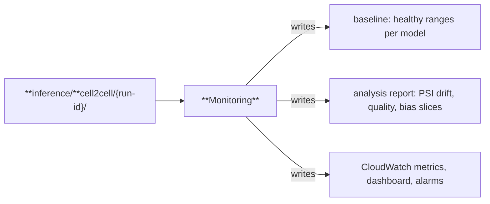

```mermaid
flowchart LR
    Out["**inference/**cell2cell/{run-id}/"] --> Mon
    Mon["**Monitoring**"] -->|writes| Base["baseline: healthy ranges per model"]
    Mon -->|writes| Rep["analysis report: PSI drift, quality, bias slices"]
    Mon -->|writes| CW["CloudWatch metrics, dashboard, alarms"]
```
